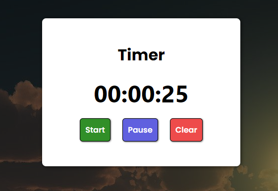
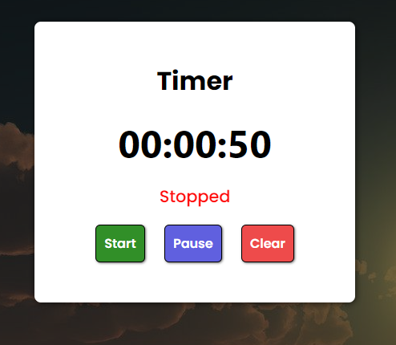

# StopWatch

# Rode o projeto
<a hred="https://luiz-tm.github.io/stopwatch/">Clique aqui para rodar o projeto.</a>
 
## Introdução
- Um simples cronômetro criado para treinar meus conhecimentos em desenvolvimento web.

## Tecnologias e conhecimentos utilizados
- Utilizado HTML5, CSS3, JavaScript.
- Utilizado conhecimentos em Clean Code Architecture.
- Utilizado Easy Maintenance Code.
- Utilizado Code Organization.

## Imagens

